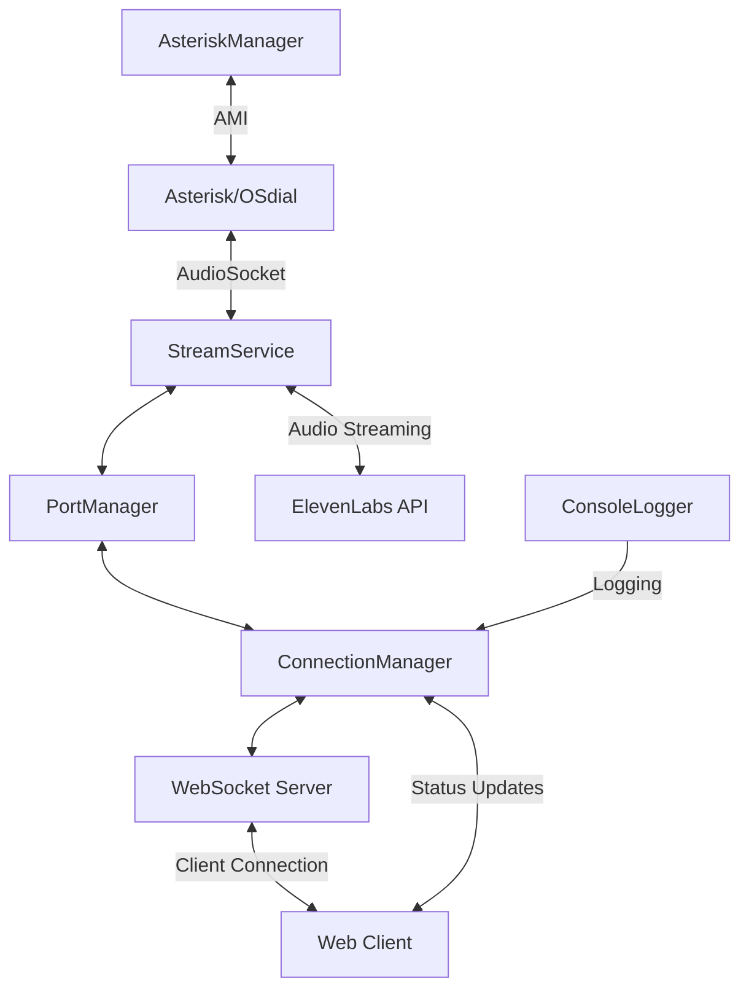

# System Patterns: ElevenLabs AI Call App

## System Architecture

The ElevenLabs AI Call App follows a modular architecture with clear separation of concerns. The system is built around several key components that work together to handle call audio streaming and AI agent interactions.

## Key Technical Decisions

### 1. Node.js Runtime
- **Decision**: Use Node.js as the application runtime
- **Rationale**: Excellent for handling asynchronous I/O operations, which is critical for real-time audio streaming and WebSocket connections
- **Impact**: Enables efficient handling of multiple concurrent connections with minimal resource usage

### 2. AudioSocket Protocol
- **Decision**: Use Asterisk's AudioSocket protocol for call audio streaming
- **Rationale**: Native integration with Asterisk, provides bidirectional audio streaming capabilities
- **Impact**: Allows direct connection to Asterisk's call audio without complex SIP or RTP handling

### 3. WebSocket Communication
- **Decision**: Use WebSockets for both client communication and ElevenLabs API integration
- **Rationale**: Provides real-time bidirectional communication with low latency
- **Impact**: Enables responsive UI updates and efficient streaming of audio data

### 4. Dynamic Port Allocation
- **Decision**: Implement dynamic port allocation for AudioSocket connections
- **Rationale**: Allows handling multiple concurrent calls without port conflicts
- **Impact**: Enables scalability for handling many simultaneous calls

### 5. Event-Driven Architecture
- **Decision**: Use event emitters for component communication
- **Rationale**: Decouples components and allows for flexible event handling
- **Impact**: Makes the system more maintainable and extensible

## Design Patterns in Use

### 1. Factory Pattern
- **Implementation**: StreamService factory in PortManager
- **Purpose**: Creates new StreamService instances for each connection
- **Benefit**: Encapsulates creation logic and ensures proper initialization

### 2. Singleton Pattern
- **Implementation**: ConnectionManager, PortManager
- **Purpose**: Ensures a single instance manages all connections/ports
- **Benefit**: Centralizes state management and prevents resource conflicts

### 3. Observer Pattern
- **Implementation**: EventEmitter-based communication
- **Purpose**: Components can subscribe to events from other components
- **Benefit**: Loose coupling between components

### 4. Facade Pattern
- **Implementation**: AsteriskManager provides a simplified interface to Asterisk AMI
- **Purpose**: Hides complexity of the Asterisk Manager Interface
- **Benefit**: Simplifies interaction with Asterisk from other components

### 5. Proxy Pattern
- **Implementation**: ConsoleLogger intercepts console output
- **Purpose**: Redirects console output to both terminal and WebSocket clients
- **Benefit**: Provides visibility into server operations for remote clients

## Component Relationships

### StreamService
- **Responsibility**: Handles AudioSocket protocol and audio streaming
- **Relationships**:
  - Receives raw audio data from Asterisk
  - Processes audio packets and extracts data
  - Sends audio to ElevenLabs API
  - Receives AI-generated audio and sends to caller

### PortManager
- **Responsibility**: Manages AudioSocket server ports
- **Relationships**:
  - Allocates and releases ports for AudioSocket servers
  - Creates and manages call servers for each connection
  - Connects StreamService instances with ElevenLabs WebSockets

### ConnectionManager
- **Responsibility**: Manages WebSocket connections and client state
- **Relationships**:
  - Tracks active client connections
  - Manages ElevenLabs WebSocket connections
  - Handles status updates and logging to clients
  - Manages connection lifecycle and cleanup

### AsteriskManager
- **Responsibility**: Interfaces with Asterisk Manager API
- **Relationships**:
  - Initiates outbound calls
  - Monitors call status
  - Handles call hangup
  - Retrieves active channel information

### ConsoleLogger
- **Responsibility**: Captures and redirects console output
- **Relationships**:
  - Intercepts console.log, console.error, etc.
  - Forwards logs to ConnectionManager for client distribution
  - Maintains original console functionality

## Data Flow

### Inbound Call Flow
1. Call arrives at Asterisk and is routed to AudioSocket application
2. AudioSocket connects to ElevenLabs AI Call App on configured port
3. StreamService receives connection and processes audio packets
4. PortManager establishes connection to ElevenLabs API
5. Audio is streamed bidirectionally between caller and AI agent
6. Call terminates and resources are cleaned up

### Outbound Call Flow
1. Client requests call via WebSocket API
2. ConnectionManager registers request and parameters
3. PortManager allocates port and creates call server
4. AsteriskManager initiates call via Asterisk AMI
5. When call connects, AudioSocket streams audio to allocated port
6. StreamService processes audio and connects to ElevenLabs API
7. Audio is streamed bidirectionally between caller and AI agent
8. Call terminates and resources are cleaned up

## Error Handling Strategy

- **Connection Failures**: Automatic cleanup of resources and client notification
- **Audio Processing Errors**: Graceful degradation with continued service when possible
- **API Timeouts**: Configurable timeouts with fallback behaviors
- **Resource Exhaustion**: Proper error responses when ports or connections are exhausted
- **Unexpected Termination**: Cleanup hooks ensure resources are released
